# Updating Fantasy Match Stats

Step-by-step guide for ingesting a finished match's player stats from Opta into the
fantasy app, from the Opta website all the way to recalculating positions.

The running example throughout is **Netherlands vs Morocco** (`NED vs MAR`).

> **Tip:** keep one browser tab on the Opta site and LibreOffice Calc open on the
> `OPTA MATCH ODS Template.ods` in this folder. You'll copy/paste between them.

---

## 1. Find the game on the Opta page

Go to the Opta player-stats site and find the finished match under **Results**.

[optaplayerstats.statsperform.com → FIFA World Cup → Opta Statistics](https://optaplayerstats.statsperform.com/)

Click the match you want to ingest (e.g. *Netherlands 1 v 1 Morocco*).

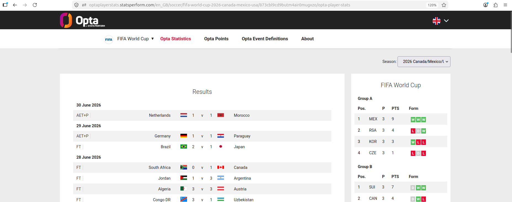

---

## 2. Open the **OPTA POINTS** view

Inside the match, switch to the **OPTA POINTS** tab (next to *Match Summary* and
*Match Details*). This is the view that exposes the per-player fantasy stat columns
we need.

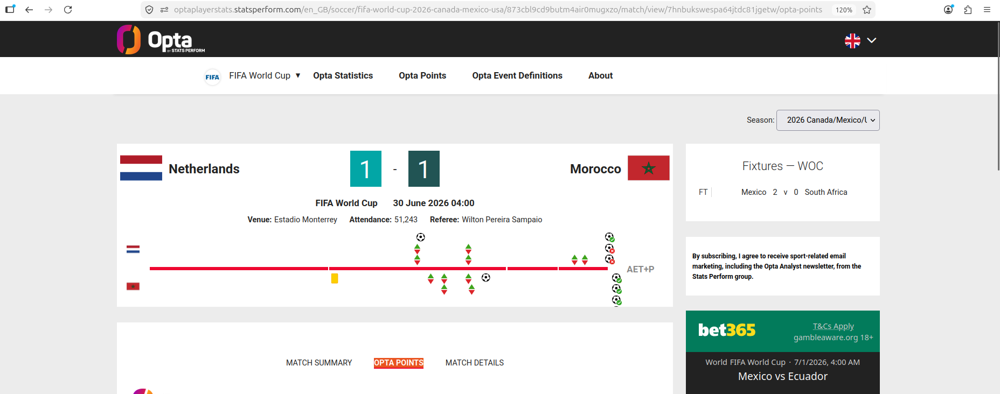

---

## 3. Read the final score

Note the main result at the top of the match header — team names and the final
score. For Netherlands vs Morocco this is **1 – 1**.

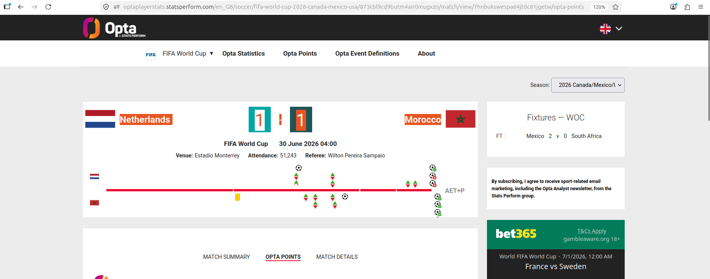

> Use the **regular full-time / AET score** as shown in the header. Penalty
> shoot-out results are not entered here.

---

## 4. Paste the result into the **RES** sheet

Open `OPTA MATCH ODS Template.ods` and go to the **RES** sheet. Row 2 holds the
result in this layout:

| A (T1 name) | B (G1) | C | D (G2) | E (T2 name) |
|-------------|--------|---|--------|-------------|
| Netherlands | 1      | - | 1      | Morocco     |

Fill in the two team names and the two goal counts.

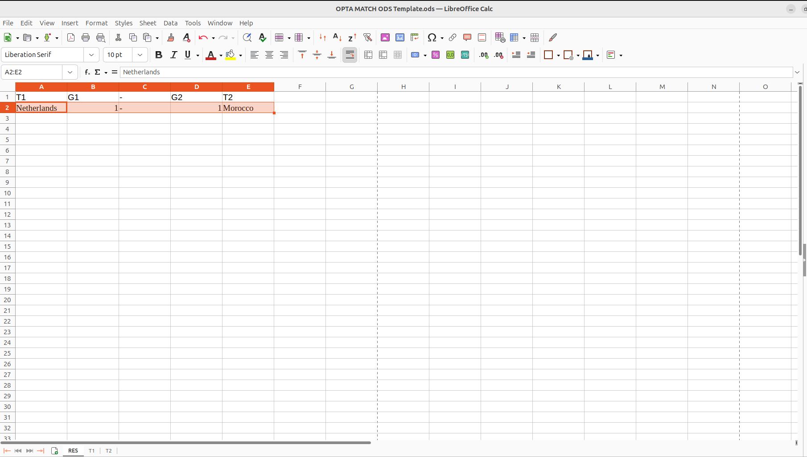

---

## 5. Filter by the first team and choose **STATS**

Back on Opta, filter the player table by the **first team** (the tab with the team
name, e.g. *Netherlands*) and switch the toggle from **Points** to **Stats**.

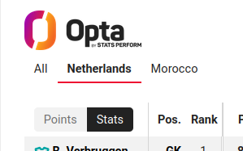

---

## 6. Copy the full stats table (Name → PSAV)

Scroll to the end of the table and select **every player row** for that team, from
the **Name** column on the left through the **PSAV** column on the right. Copy the
whole block.

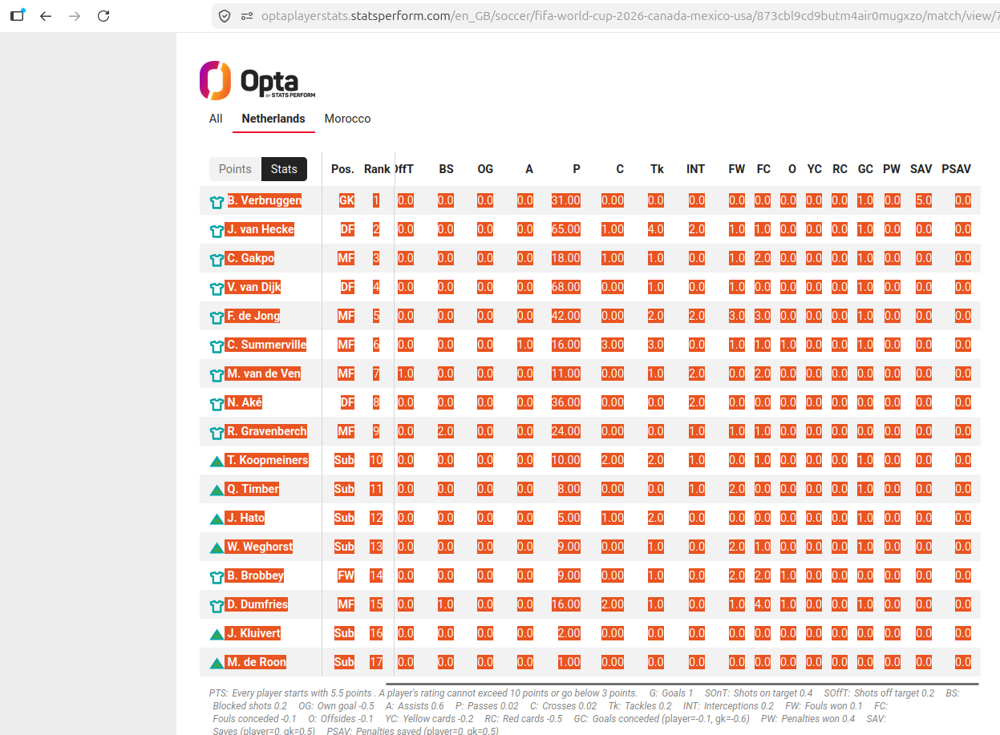

> Make sure you grab all columns: `Name, Pos, Rank, PTS, MP, G, SOnT, SOffT, BS,
> OG, A, P, C, Tk, INT, FW, FC, O, YC, RC, GC, PW, SAV, PSAV`.

---

## 7. Paste it under the **T1** sheet

In the ODS, go to the **T1** sheet and paste the copied table starting at the first
data row (under the header). T1 = first team (Netherlands).

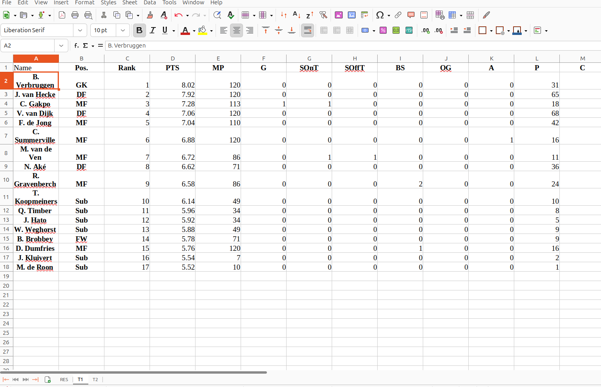

---

## 8. Repeat for the second team → **T2** sheet

Do exactly the same for the **second team** (Morocco): filter by that team on Opta,
**Stats** toggle, copy Name→PSAV…

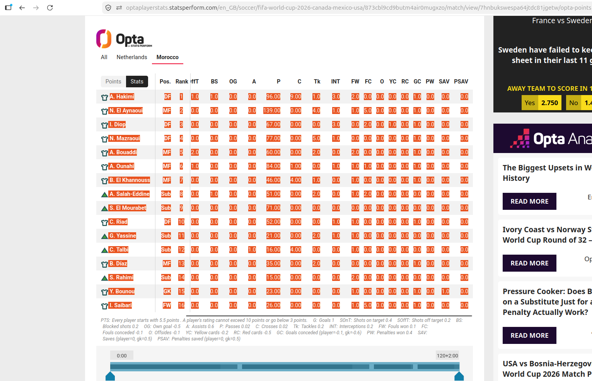

…then paste it into the **T2** sheet.

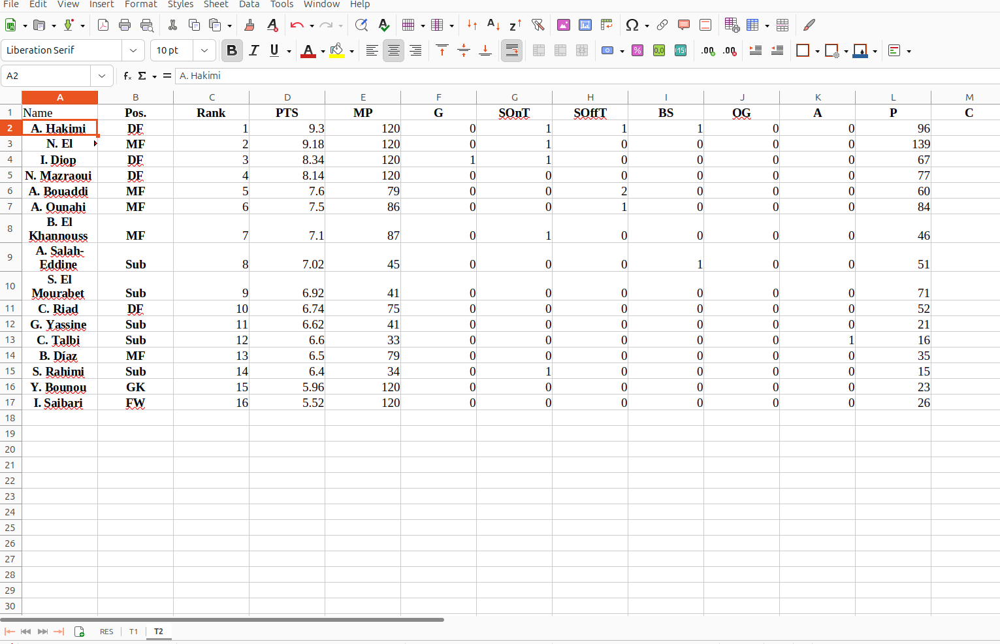

---

## 9. Save the file

Save the ODS named after the match. The convention is the match short form, e.g.
**`NED vs MAR.ods`**. Save it into this folder
(`apps/fantasy/data/stats/raw_opta_stats/`).

---

## 10. Map Opta names → fantasy DB names (run via Claude)

From the `predictor` directory, run Claude with this prompt:

```
read @apps/fantasy/data/stats/raw_opta_stats/README.md and apply it to @"apps/fantasy/data/stats/raw_opta_stats/NED vs MAR.ods" using @apps/fantasy/data/stats/raw_opta_stats/players_rows_new_version.csv
```

For opencode code agent please use the next prompt:

```txt
Read @apps/fantasy/data/stats/raw_opta_stats/README.md and apply it to @apps/fantasy/data/stats/raw_opta_stats/ESP vs AUT.ods using @apps/fantasy/data/stats/raw_opta_stats/add_db_name_col_opencode.py to modify teh ODS file and the @apps/fantasy/data/stats/raw_opta_stats/players_rows_new_version.csv to map the players name in the DB name column.
```

This adds the **`DB Name`** column to T1/T2 by matching the abbreviated Opta names
(`V. van Dijk` → `Virgil van Dijk`) against the player DB export.

**If there are players "NOT FOUND":**
- Correct them manually in the cell (unusual abbreviations, accents, etc.), **or**
- Delete the row — it's almost always a deep-bench player nobody owns anyway.

> Details of what the script does and the file formats are in
> [`README.md`](README.md).

---

## 11. Upload the ODS in the Admin panel

Log into the app as **ADMIN** and open the Admin panel. Find the
**"Carga de estadísticas Opta ODS"** card.

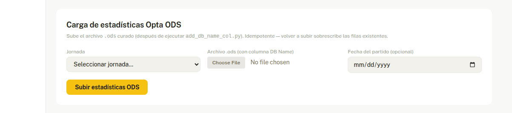

1. Pick the **Jornada** (matchday) the file belongs to.
2. Choose the `.ods` file you just curated (e.g. `NED vs MAR.ods`).
3. Click **Subir estadísticas ODS**.

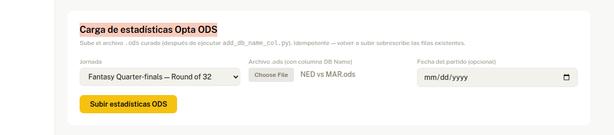

> The upload is **idempotent** — re-uploading the same file overwrites the existing
> rows, so it's safe to redo if you fix a name and re-run the mapping.

---

## 12. Recalculate positions

What you do next depends on the stage of the match.

### Group stage → **Calcular posiciones**

In the **"Calcular posiciones"** card, pick the correct **matchday** and run it.
This scores all teams for that jornada and writes `fantasy_standings`.

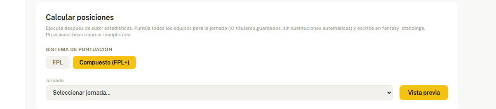

### Knockout stage ("MATA-MATA") → **Cuadro eliminatorio**

Go to the **"Cuadro eliminatorio"** card, select the **round**, and click
**"Guardar jornada (provisional)"**. This links the round to its jornada so live
H2H points show in the bracket without closing the round.

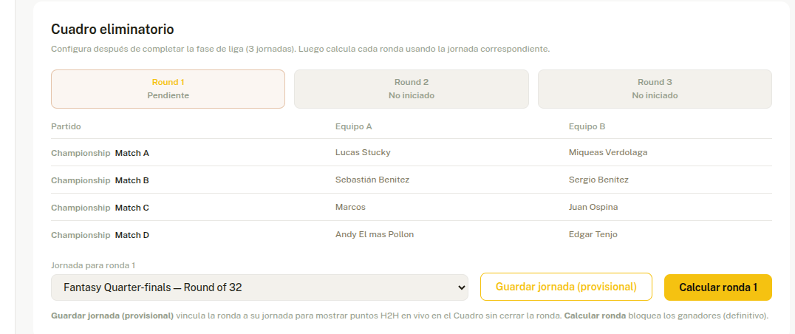

> **Guardar jornada (provisional)** = show live H2H points, round stays open.
> **Calcular ronda** = locks in the winners (definitive). Use *provisional* while a
> round is still in progress.

---

That's it — the match stats are now live in the fantasy app. ✅
